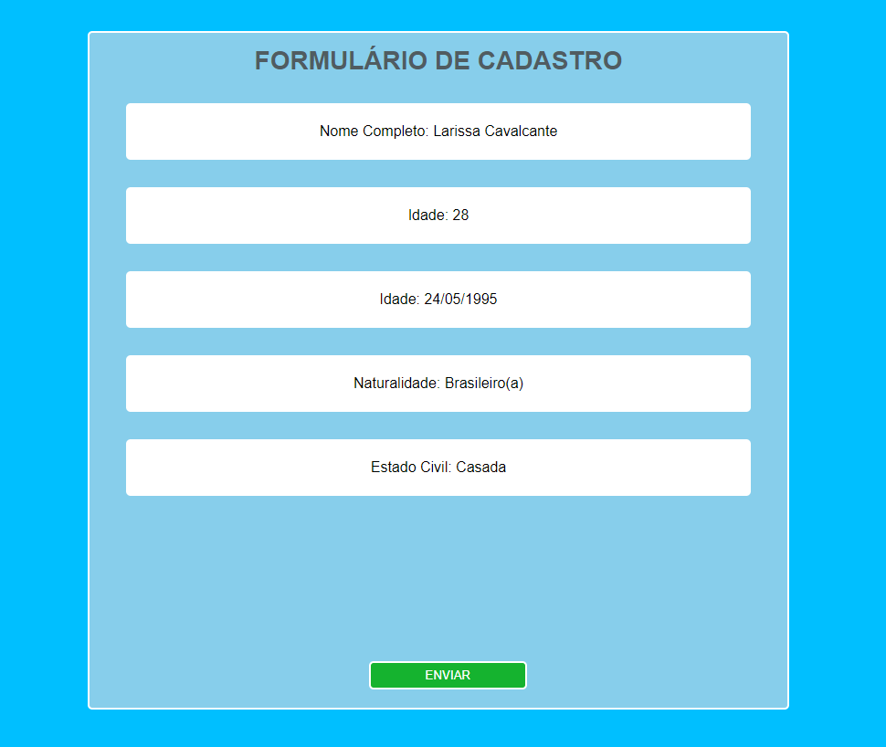
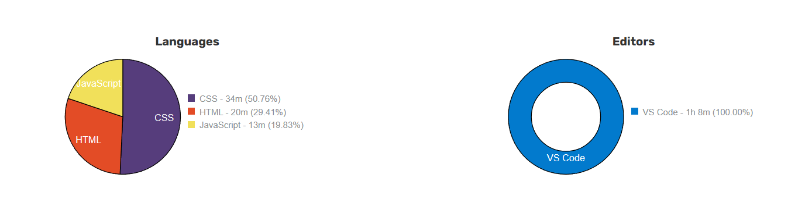

# Projeto-Intermediário-JavaScritp-05
O Projeto aqui é do nível <b>Intermediário</b>, utilizando HTML/CSS e JavaScritp

 
    
    
              

#

#05 Exibindo Informações do User na Tela

O Scritp irar exibir Informações capturadas do User e informa-las na Tela, nesse programa foi utilizado algumas funções como:

- Variaveis
- getElementById("")
- prompt
- console.log()
- Number()

#

    

#

# Coding Time

    

